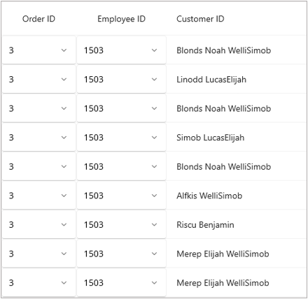

# How to Change selected index of one picker in other pickers selection changed event in DataGrid.
You can change the selected index of one picker in a grid column by changing the selected index of other picker in another grid column by binding a common property to the [SelectedIndex](https://help.syncfusion.com/cr/maui/Syncfusion.Maui.DataGrid.SfDataGrid.html#Syncfusion_Maui_DataGrid_SfDataGrid_SelectedIndex) property of both the pickers. 
 ```XML
 <syncfusion:SfDataGrid  ItemsSource="{Binding OrdersInfo}"
                        AutoGenerateColumnsMode="None"
                        ColumnWidthMode="Auto"
                        DefaultColumnWidth="155">

    <syncfusion:SfDataGrid.Columns>
        <syncfusion:DataGridTemplateColumn MappingName="Order ID">
            <syncfusion:DataGridTemplateColumn.CellTemplate>
                <DataTemplate>
                    <Picker TextColor="Black"
                            ItemsSource="{Binding  Source={x:Reference viewModel},Path=  FirstPickerItem}"
                            SelectedIndex="{Binding Source={x:Reference viewModel},Path= Selectedindex, Mode=TwoWay}">
                    </Picker>
                </DataTemplate>
            </syncfusion:DataGridTemplateColumn.CellTemplate>
        </syncfusion:DataGridTemplateColumn>

        <syncfusion:DataGridTemplateColumn MappingName="Employee ID ">
            <syncfusion:DataGridTemplateColumn.CellTemplate>
                <DataTemplate>
                    <Picker TextColor="Black"
                            ItemsSource="{Binding  Source={x:Reference viewModel},Path=  SecondPickerItem}"
                            SelectedIndex="{Binding  Source={x:Reference viewModel},Path= Selectedindex, Mode=TwoWay}">
                    </Picker>
                </DataTemplate>
            </syncfusion:DataGridTemplateColumn.CellTemplate>
        </syncfusion:DataGridTemplateColumn>
        <syncfusion:DataGridTextColumn MappingName="CustomerID"
                                       HeaderText="Customer ID" />
    </syncfusion:SfDataGrid.Columns>

</syncfusion:SfDataGrid> 
 ```
 
EmployeeViewModel.cs
 
 ```XML
private int[] FirstPickerItems = new int[] { 0, 1, 2, 3, 4, 5, 6 };
private int[] SecondPickerItems = new int[] { 1500, 1501, 1502, 1503, 1504, 1505, 1506 };

 private ObservableCollection<int> firstPickerItem;

 public ObservableCollection<int> FirstPickerItem
 {
     get { return firstPickerItem; }
     set
     {
         this.firstPickerItem = value;
         OnPropertyChanged("FirstPickerItem");
     }
 }

 private ObservableCollection<int> secondPickerItem;

 public ObservableCollection<int> SecondPickerItem
 {
     get { return secondPickerItem; }
     set
     {
         this.secondPickerItem = value;
         OnPropertyChanged("SecondPickerItem");
     }
 } 
 ```
 
**Screenshot**
 
 

[View sample in GitHub](https://github.com/SyncfusionExamples/How-to-Change-selected-index-of-one-picker-in-other-pickers-selection-changed-event-in-DataGrid)
 
Take a moment to explore this [documentation](https://help.syncfusion.com/maui/datagrid/overview), where you can find more information about Syncfusion .NET MAUI DataGrid (SfDataGrid) with code examples. Please refer to this [link](https://www.syncfusion.com/maui-controls/maui-datagrid) to learn about the essential features of Syncfusion .NET MAUI DataGrid (SfDataGrid).
 
##### Conclusion
 
I hope you enjoyed learning about how to Change selected index of one picker in other pickers selection changed event in DataGrid.
 
You can refer to our [.NET MAUI DataGrid’s feature tour](https://www.syncfusion.com/maui-controls/maui-datagrid) page to learn about its other groundbreaking feature representations. You can also explore our [.NET MAUI DataGrid Documentation](https://help.syncfusion.com/maui/datagrid/getting-started) to understand how to present and manipulate data. 
For current customers, you can check out our .NET MAUI components on the [License and Downloads](https://www.syncfusion.com/sales/teamlicense) page. If you are new to Syncfusion, you can try our 30-day [free trial](https://www.syncfusion.com/downloads/maui) to explore our .NET MAUI DataGrid and other .NET MAUI components.
 
If you have any queries or require clarifications, please let us know in the comments below. You can also contact us through our [support forums](https://www.syncfusion.com/forums), [Direct-Trac](https://support.syncfusion.com/create) or [feedback portal](https://www.syncfusion.com/feedback/maui?control=sfdatagrid), or the feedback portal. We are always happy to assist you!